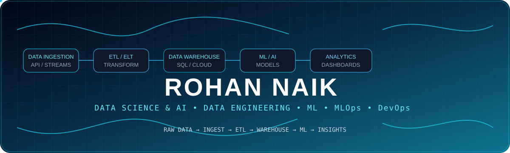

  

<!-- 🚀 ANIMATED PROFILE HEADER -->

  

  

  

  <b>⚡ Data → Engineering → Intelligence → Impact</b>

  

### ⚡ Building Intelligent Systems from Data

**Data Science & AI Student** • **Machine Learning** • **Data Engineering** • **MLOps** • **DevOps**

---

### 🧠 About Me

🎓 Data Science & AI Student  
⚙️ Building Data Pipelines & ETL Workflows  
🤖 Exploring Machine Learning & AI  
🚀 Learning MLOps & DevOps  
📊 Turning raw data into intelligent solutions

📊 **Building data-driven applications and intelligent systems**

> **My focus:** Building the complete journey from **raw data → reliable pipelines → machine learning → actionable insights.**

<!-- ═══════════════════════════════════════════════════════════════ -->

👨‍💻 About Me

🎓 B.Sc. Data Science & AI student at B.K. Birla College  
🤖 Interested in Machine Learning, Artificial Intelligence & Computer Vision  
📊 Building data-driven applications and ML projects  
⚙️ Exploring DevOps, MLOps, CI/CD & AI deployment  
🏆 Smart India Hackathon 2026 — Team Vanguard  
🚀 Currently working on **Viranikosh**, an AI-powered cultural heritage preservation platform
🎯 Current Focus

📚 Strengthening my **Data Science & Machine Learning** skills
⚙️ Learning **MLOps, Docker, CI/CD and deployment**
🧠 Building practical **AI-powered applications**
🚀 Contributing to real-world **hackathon projects**

Learn → Build → Deploy → Improve
---

🛠️ Tech Arsenal

### 👨‍💻 Languages

### 🤖 Data Science & AI

### ⚙️ DevOps & MLOps

### 🌐 Development

### 📊 Tools

---

## 🔥 GitHub Stats & Analytics

